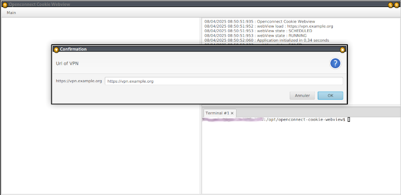
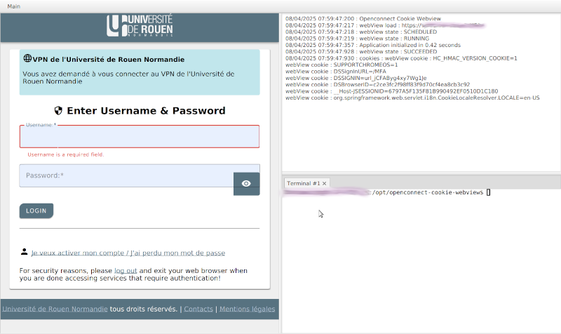
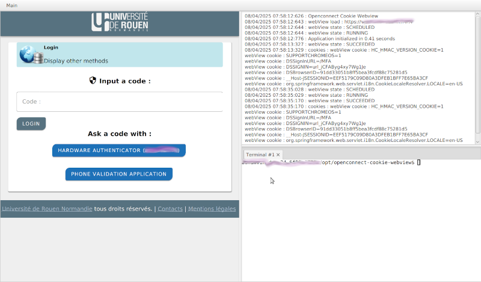
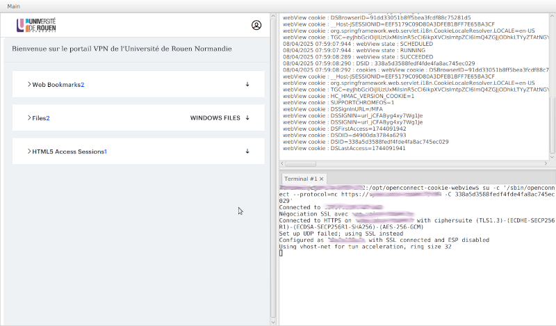

# OpenConnect Cookie WebView

**OpenConnect Cookie WebView** is a Java-based client that allows launching OpenConnect using a DSID cookie retrieved from a web browser session after user authentication.

This approach is particularly useful to bypass two-factor authentication (2FA) or one-time password (OTP) challenges typically required during VPN authentication via a browser.

The DSID cookie, obtained after MFA login, is a session cookie used by the VPN service. Once retrieved, it is sufficient to authenticate the user for VPN access.

## Installation (Linux/Debian)
To use OpenConnect Cookie WebView on a Debian-based Linux system, you need to install the following dependencies:

Install maven, *OpenJDK 17*, openjfx and openconnect:

```
apt install maven openjdk-17-jdk openjfx openconnect
```

Get the latest version of jar of openconnect-cookie-webview from [GitHub](https://github.com/vbonamy/openconnect-cookie-webview/releases).

And run it with the following command:

```bash
java --module-path /usr/share/openjfx/lib/ --add-modules javafx.controls,javafx.fxml,javafx.base,javafx.media,javafx.graphics,javafx.swing,javafx.web -jar openconnect-cookie-webview-1.0.jar
```

Next, configure the application clicking on the **VPN Configuration** button and **OpenConnect command configuration** in the **Main* menu.

You can now use the application to authenticate to your VPN service (with MFA if needed).

If you don't see cookies in the logs tab, there is a problem with the cookie extraction with your version of Java : 
this application is working with OpenJDK 17 and OpenJFX 17 **only**.

## Build and Run from Source

Clone the project :

```
git clone <repository-url>
cd openconnect-cookie-webview
```

You can then run the application using:
```
mvn javafx:run
```

Alternatively, run it as a standard Java application with proper JavaFX module options :

```bash
mvn clean package
java --module-path /usr/share/openjfx/lib/ --add-modules javafx.controls,javafx.fxml,javafx.base,javafx.media,javafx.graphics,javafx.swing,javafx.web -jar target/openconnect-cookie-webview-1.1-SNAPSHOT.jar
```

## Usage
Launch the application.

In the main menu, modify configurations if necessary. You can set the following parameters:
- **VPN URL**: The URL of your VPN service.
- **OpenConnect command**: The command template for OpenConnect. 

Authenticate through the integrated WebView. This will open your institution’s login page in an embedded browser.

Once logged in (via 2FA/OTP if required), the application will extract the DSID cookie from the session.

It will then use this cookie to authenticate and initiate a VPN connection using OpenConnect.


## Technologies Used

This application is built with **Java**, **Spring**, and **JavaFX**, and uses **Maven** for building and dependency management.

- Requires **OpenJDK 17** or newer.
- Requires **OpenJFX**.
- Designed to run on **Linux** systems.

## Development Environment

You can use **Eclipse** (e.g., via Spring Tools) or **IntelliJ IDEA** for development.

To run the project from the command line, use:
```bash
mvn javafx:run
```

## Debugging in IDE
Debugging with breakpoints may not work properly when using the Maven plugin directly from your IDE. For better debugging support, run the application as a standard Java application instead. In that case, you will need to manually specify the JavaFX module options. For example:

```bash
--module-path /usr/share/openjfx/lib/ --add-modules javafx.controls,javafx.fxml,javafx.base,javafx.media,javafx.graphics,javafx.swing,javafx.web
```

Make sure to adjust the path to match your local JavaFX installation.

## License

This project is licensed under the Apache License 2.0. See the [LICENSE](LICENSE) file for details.

## Contributing

Contributions are welcome! If you have suggestions for improvements or new features, feel free to open an issue or submit a pull request.

## Screenshots







